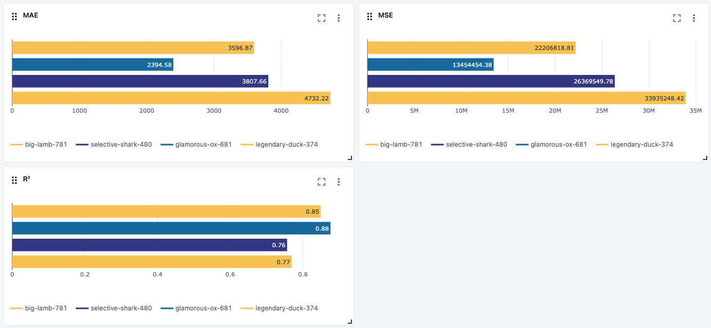

# Réentraînement d'un modèle

## Objectif

Ce projet entraîne un modèle de régression puis suit les performances dans MLflow pour comparer les runs de réentraînement.

---

## Modifications réalisées

- `main.py`
  - Intégration de MLFlow
  - Création d'un nouveau modèle `model_2026_03`
- Logging des métriques d’évaluation finale grace à MLFlow :
  - `MSE`, `MAE`, `R²`

## Processus d'entrainement

1. Chargement le dataset : `data/df_new.csv`.

```python
base_data_path = join("data", "df_new.csv")
```

2. Création du nouveau modèle : `model_2026_03`

```python
base_model_path = join("models", "model_2026_03.pkl")

# Création du modèle
model = create_nn_model(X_train.shape[1])
# Sauvegarde du nouveau modèle
joblib.dump(model, base_model_path)
```

3. Entraînement du modèle

```python
    # Earlystopping callback pour éviter le sur-apprentissage
    early_stop = EarlyStopping(
        monitor="val_loss", patience=10, restore_best_weights=True
    )

    # Chargement du nouveau modèle
    loaded_model = joblib.load(base_model_path)
    mlflow.sklearn.log_model(
        loaded_model, name=base_model_path.split("/")[1].replace(".pkl", "")
    )

    # Entraînement du nouveau modèle
    model, hist = train_model(
        loaded_model,
        X_train,
        y_train,
        X_val=X_test,
        y_val=y_test,
        epochs=10000,
        callbacks=[early_stop],
    )

    # Sauvegarde du modèle entrainé
    joblib.dump(model, base_model_path)
```

4. Lancement du run pour l'entrainement du nouveau modèle et la récole des metrics

```bash
python main.py
```

## Analyse des résultats



Le `premier` run en bas est le run avec l'ancien modèle et les anciennes données

Le `deuxième` run est un run avec l'ancien modèle et les nouvelles données

Le `troisième` run est celui avec le nouveau modèle et les nouvelles données

Le `quatrième` et dernier run est celui du nouveau modèle et les anciennes données

#### Pour conclure le nouveau modèle est plus performant que l'ancien modèle que ce soit sur les nouvelles ou anciennes données.

## [Export MLFlow - csv](public/runs/runs.csv)
